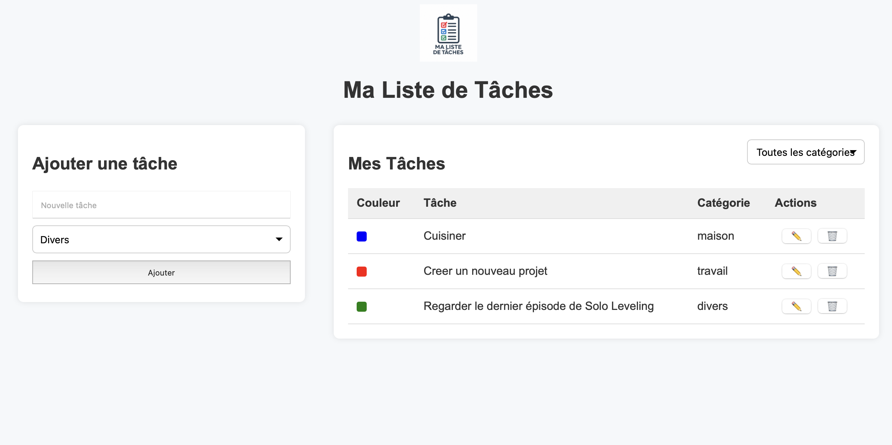

# Liste de Tâches TOHO Mahugnon

Une application web simple pour gérer vos tâches avec des catégories et des couleurs.

## Fonctionnalités

- Ajouter des tâches avec une catégorie (Travail, Maison, Divers)
- Afficher les tâches dans une liste avec des couleurs spécifiques pour chaque catégorie
- Modifier ou supprimer des tâches existantes
- Filtrer les tâches par catégorie

## Aperçu



## Structure du Projet

```
liste-taches-evoluee/
├── controller.js        # Contrôle la logique de l'application
├── index.html           # Structure HTML de l'application
├── logo.png             # Logo affiché dans l'en-tête
├── model.js             # Gestion des données et stockage local
├── style.css            # Styles CSS pour l'application
└── view.js              # Gestion de l'affichage et des interactions utilisateur
```

## Installation

1. Clonez ce dépôt :
   ```bash
   git clone https://github.com/3l4un1ck/TP-Archi-Applicative.git
   ```

2. Ouvrez `index.html` dans votre navigateur.

## Utilisation

1. Ajoutez une tâche :
   - Saisissez le texte de la tâche
   - Sélectionnez une catégorie
   - Cliquez sur "Ajouter"

2. Gestion des tâches :
   - Modifiez une tâche avec le bouton ✏️
   - Supprimez une tâche avec le bouton 🗑️

3. Filtrage :
   - Utilisez le menu déroulant pour filtrer par catégorie

## Dépendances

Aucune dépendance externe requise. L'application utilise uniquement :
- HTML5
- CSS3
- JavaScript

## Capture d'écran

Le fichier `screenshot.png` à la racine du projet montre l'application en fonctionnement.

## Auteur

TOHO Mahugnon

## Licence

[MIT](LICENSE)
